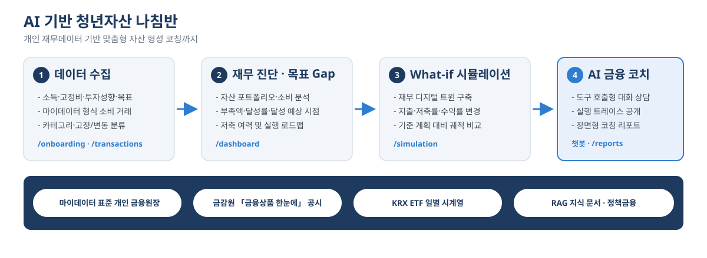
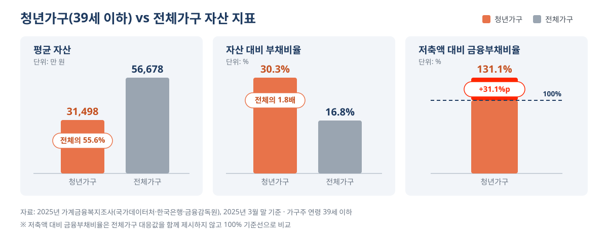
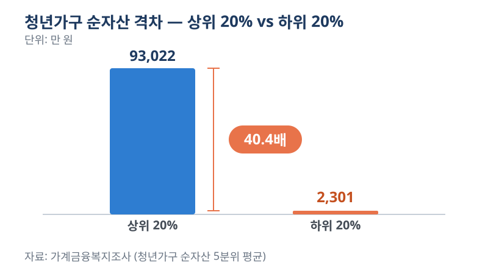
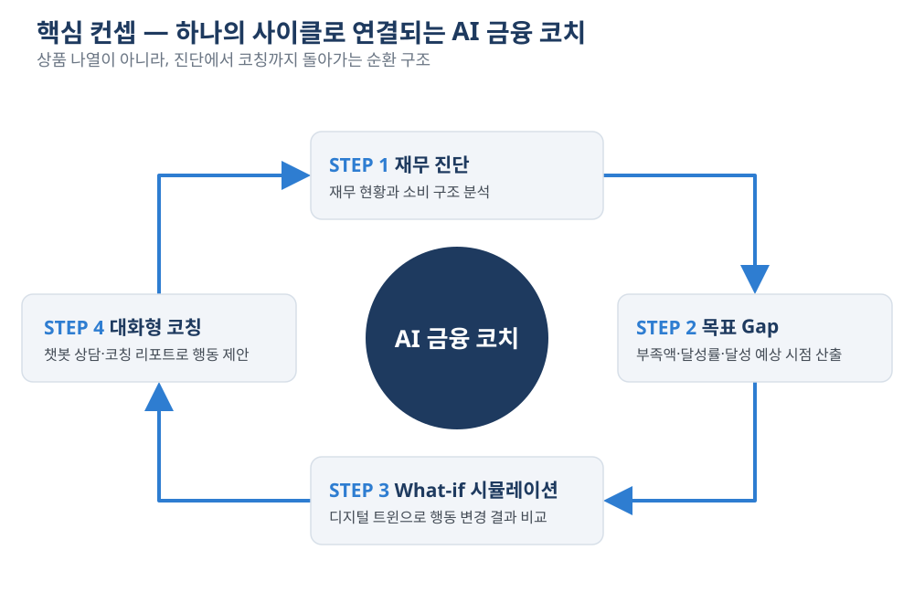
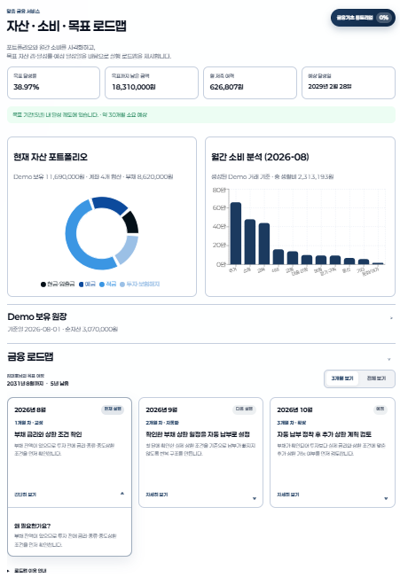
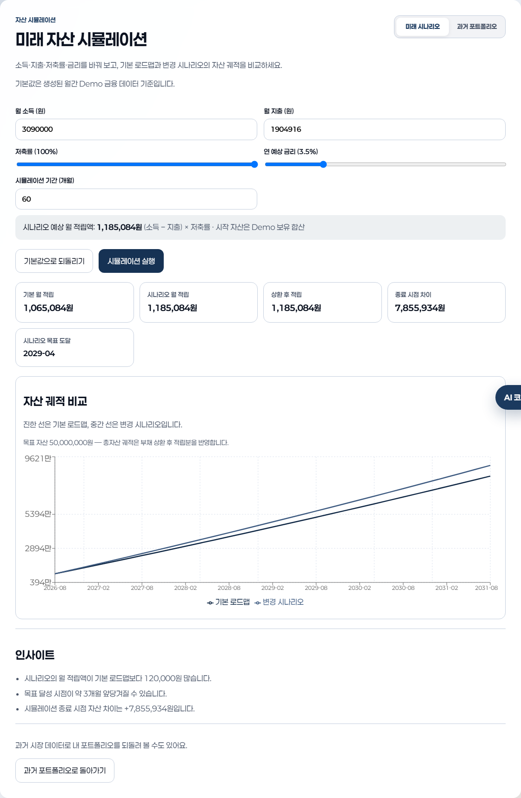
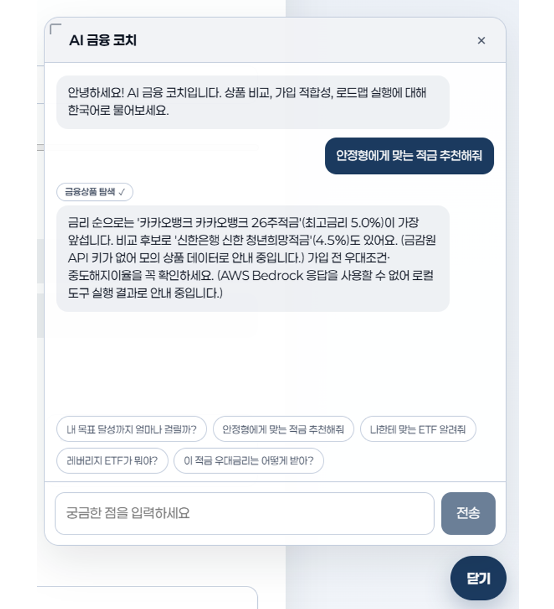
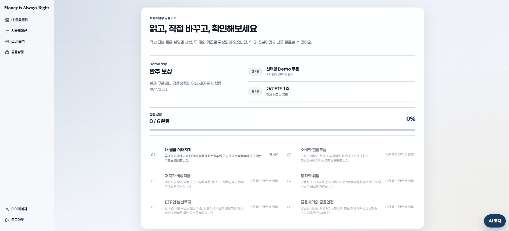
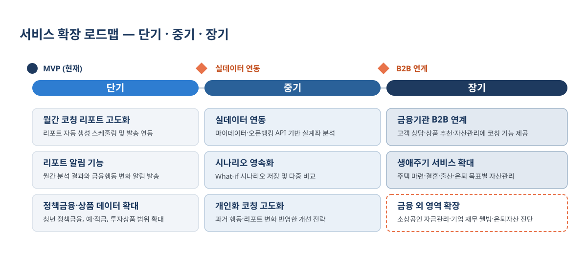

# 첨부 1 2026 금융 AI Challenge 기획서

| 항목 | 내용 |
| --- | --- |
| 팀명 | 돈은 늘 옳다 |
| 구성원 성명 | 김대호, 김태윤, 황호순, 윤성호 |

(* 필수항목)

## 1. 서비스 명칭*

> - 제안하는 AI 금융 서비스의 직관적인 명칭 기재

1. 청년 자본 지킴이
2. AI 기반 청년 맞춤형 자산 형성 플랫폼
3. Money₩aker

## 2. 아이디어 기획 핵심내용(요약)*

> - 전체 기획의 핵심 내용을 요약하여 개조식으로 간략히 작성

- 청년층의 소득·자산·소비 데이터를 분석하여 개인별 재무상태와 목표 간의 Gap을 진단하는 AI 금융 코치
- 현재의 소득·지출·저축·투자 상황을 기반으로 재무 디지털 트윈을 구축하고, What-if 시뮬레이션을 통해 행동 변화에 따른 자산 형성 결과를 비교
- Gap 분석과 시뮬레이션 결과를 바탕으로 소비·저축·투자 우선순위와 금융상품을 개인 상황에 맞게 제안
- AI Agent, RAG, 금융데이터·계산 Tool을 연계하여 분석부터 금융정보 제공까지 수행하고, 실행 과정을 공개하여 결과의 신뢰성과 투명성 확보
- 웹사이트 기반 MVP로 구현하며, 향후 마이데이터·오픈뱅킹 및 모바일 환경으로 확장하여 지속적인 개인 자산관리 서비스로 발전

**[그림 1]** 서비스 한 장 요약 — 데이터 수집부터 AI 코칭까지의 처리 흐름과 활용 데이터

## 3. 문제 정의 및 제안 배경*

> - 아이디어가 해결하고자 하는 현재 금융 서비스의 구체적인 문제점 기술
> - 특정 금융 고객(예: 사회 초년생, 카드 이용 고객 등) 및 채널(모바일 앱, 오프라인 영업점 등)을 선택한 배경과 이유 설명

### ① 청년 자산 부족

2025년 가계금융복지조사에 따르면 39세 이하 **청년가구의 평균 자산은 전체 가구 평균의 55.6% 수준**인 3억 1,498만 원이다. 또한 **자산 대비 부채 비율은 30.3%**로 전체 평균 16.8%보다 높으며, **저축액 대비 금융부채 비율은 131.1%**로 청년층의 자산 형성 여건이 상대적으로 취약한 것으로 나타났다.

**[그림 2]** 청년가구 vs 전체가구 자산 지표 비교
*자료: 2025년 가계금융복지조사(국가데이터처·한국은행·금융감독원), 2025년 3월 말 기준*

### ② 고용불안 및 주거비 부담

한국은행은 청년층의 노동시장 진입 지연이 이후 고용 안정성과 소득에 부정적인 영향을 줄 수 있다고 분석했다. 또한 주거비가 1% 상승할 때 총자산이 0.04% 감소하고, 주거비 부담 증가는 교육비 감소와 청년층 부채 증가로 이어질 수 있다고 분석했다. 이는 청년층의 **현재 소득뿐 아니라 미래 자산 형성 여력까지 제약하는 요인**으로 작용한다.

### ③ 청년층 내 자산 격차 확대

국회입법조사처에 따르면 청년가구 자산 상위 20%의 평균 순자산은 9억 3,022만 원, 하위 20%는 2,301만 원으로 **약 40.4배의 차이**가 나타났다. 또한 한국은행은 최근 세대일수록 부모의 자산이 자녀의 경제적 기회에 미치는 영향이 커지고 있다고 분석했다. 이러한 환경은 청년층의 자산 형성 기회를 제한하고 **세대·계층 간 자산 격차를 고착화**할 가능성이 있다.

**[그림 3]** 청년가구 내 순자산 격차 — 상위 20%와 하위 20%의 40.4배 차이
*자료: 국회입법조사처, 가계금융복지조사 마이크로데이터 분석*

### ④ 현재 금융서비스의 한계

현재 금융서비스는 개인의 금융데이터와 다양한 금융상품 정보를 제공하지만, 이를 소비·자산·부채·투자정보를 종합한 **개인별 자산 형성 전략으로 연결하는 데에는 한계**가 있다. 특히 사회초년생은 금융 경험과 초기 자산이 부족한 상황에서 저축과 투자 중 무엇을 우선할지, 어느 정도의 금액을 저축·투자할지, 어떤 소비를 조정해야 할지를 스스로 판단해야 한다.

따라서 단순한 금융상품 추천을 넘어 **개인의 현재 재무상황을 진단**하고, **소비·저축·투자에 대한 우선순위를 제시**하며, **향후 자산 형성 결과까지 시뮬레이션**할 수 있는 금융서비스가 필요하다.

이러한 문제에 대응하여 금융위원회 역시 2026년부터 청년의 소득·자산·부채 등 재무상황을 기반으로 한 맞춤형 재무상담을 확대하고 있으며, 마이데이터를 활용한 금융앱의 재무진단 서비스도 청년 맞춤형으로 개편하고 있다. 이는 청년층의 **개별 재무상황에 기반한 체계적인 자산관리 지원**에 대한 정책적 수요가 높아지고 있음을 보여준다.

### ⑤ 대상 고객 및 채널 선정 배경

본 서비스는 사회초년생을 포함한 **자산 형성 초기의 청년 금융소비자**를 주요 대상으로 한다. 이들은 자산 형성을 시작하는 중요한 시기에 있으나 소득·자산·금융 경험이 상대적으로 부족하기 때문에 개인의 상황에 맞는 금융 의사결정을 지원할 필요가 있다.

채널은 웹사이트를 기반으로 MVP를 구현하고 향후 모바일 웹/앱으로 확장한다. 웹사이트에서는 금융정보를 대시보드로 통합하여 소비패턴 분석 → 자산현황 진단 → AI 기반 금융전략 제안 → 자산 형성 시뮬레이션을 하나의 흐름으로 제공한다. 향후 모바일 환경으로 확장하여 청년 금융소비자가 시간과 장소의 제약 없이 자신의 금융상황을 확인하고 지속적으로 자산 형성을 관리할 수 있도록 한다.

**근거 자료**
- 국회 입법 조사처: '청년 자산형성 지원사업'은 취약청년에게 어떤 의미인가?
  https://www.nars.go.kr/news/view.do?brdSeq=49486&cmsCode=CM0026
- 한국은행: 청년세대 노동시장 진입 지연과 주거비 부담의 생애영향 평가
  https://www.bok.or.kr/portal/bbs/P0002353/view.do?depth=200433&menuNo=200433&nttId=10095691
- 금융위원회: 희망하는 모든 청년에게 1:1 맞춤형 재무상담을 제공합니다 - 청년 모두를 위한 재무상담 TF 3차 회의 개최 및 추진방안 발표
  https://www.fsc.go.kr/no010101/87218

## 4. 서비스 컨셉 및 차별성*

> - 서비스의 핵심 컨셉과 기존 금융 앱 대비 확실한 독창성·차별성 기술

### 핵심 컨셉

본 서비스는 금융상품을 단순히 나열하고 추천하는 기존 방식에서 벗어나, 「재무 진단 → 목표 Gap → What-if 시뮬레이션 → 대화형 코칭」을 하나의 사이클로 연결하는 **AI 금융 코치**를 지향한다.

**[그림 4]** 핵심 컨셉 — 재무 진단·목표 Gap·What-if 시뮬레이션·대화형 코칭의 순환 구조

### 기존 금융 서비스 대비 포지션

| 기존 서비스 유형 | 한계 | 대응 |
| --- | --- | --- |
| 은행 및 증권 앱 | 자사 상품 중심 나열 - 개인 목표와의 연결이 약함 | 금융감독원 공시 데이터를 목표 Gap과 저축 여력에 연결 |
| 가계부 | 소비 기록에 그치고 목표 달성 경로를 제시하지 않음 | 소비 기록을 저축 여력 추정과 시뮬레이션 입력으로 사용 |
| 로보어드바이저 | 투자 배분에 편중 - 예적금, 저축 여력 설계가 분리됨 | 예적금, 연금, ETF를 성향 기준으로 통합하여 포트폴리오 제시 |
| 범용 AI 챗봇 | 사용자 재무 맥락 및 공시 데이터가 없어 일반론에 그침 | AI가 개인 재무 도구와 공시 원장을 직접 호출해 답변 |

### 차별점 1 - Gap 기반 개인 금융 진단

사용자의 소득·지출·자산·부채·저축·투자 현황과 재무목표를 종합적으로 분석하여 현재 재무상태를 진단한다. 단순히 현재 자산과 목표 자산의 차이만 계산하는 것이 아니라 소득 대비 지출 구조, 저축 여력, 부채 부담, 자산 구성, 목표 달성 예상 시점 등을 함께 분석하여 목표 달성을 가로막는 주요 요인을 파악한다.

이를 바탕으로 목표 자산과 현재 자산의 Gap을 저축·소비·부채·금융상품(예적금·연금) 등 구체적인 개선 영역으로 분류하고, 사용자가 어떤 부분을 우선적으로 개선해야 하는지 제시한다. 이를 통해 금융상품을 선택하기 전에 현재 자신의 재무상태에서 무엇이 부족한지 먼저 파악할 수 있도록 한다.

> **[그림 5] 개인화 대시보드 Gap 분석 화면**
> - **형태**: 실제 구현 화면 캡처 (`/`)
> - **내용**: 목표 Gap·달성률·달성 예상 시점 카드, 자산 포트폴리오 도넛, 소비 분석 막대, 규칙 기반 로드맵이 한 화면에 함께 보이도록 캡처
> - **출처**: 캡처 조건 — 월 소득 320만 원 / 고정비 150만 원 / 위험중립형 / 목표 5,000만 원·5년 프로필 기준
> - **의도**: Gap 기반 진단이 개념이 아니라 실제 동작하는 기능임을 입증
>
> <!--  -->

### 차별점 2 - 개인 재무 디지털 트윈 기반 What-if 시뮬레이션

사용자의 소득·지출·자산·부채·저축·투자 데이터를 기반으로 개인별 재무 디지털 트윈을 구축한다. 이를 통해 현재 금융행동을 유지하는 기준 계획(Baseline)과 특정 행동을 변경한 What-if 시나리오를 동일한 재무모델에서 비교할 수 있다.

"월 지출을 12만 원 줄인다면?", "저축액을 20만 원 늘린다면?", "투자를 시작한다면?"과 같은 변화를 적용하여 예상 자산, 목표 달성 시점, 목표와의 Gap이 어떻게 달라지는지를 시뮬레이션한다. 사용자는 이를 통해 자신의 행동 변화가 미래 자산에 미치는 영향을 직관적으로 확인하고 목표 달성에 효과적인 행동을 선택할 수 있다.

> **[그림 6] What-if 시뮬레이션 궤적 비교 화면**
> - **형태**: 실제 구현 화면 캡처 (`/simulation`)
> - **내용**: 기준 계획(Baseline) 궤적, 변경 시나리오 궤적, 목표선이 함께 표시된 라인 차트 + 최종 예상 자산·목표 달성 시점 차이 요약 영역
> - **출처**: 캡처 조건 — 본문 예시와 동일하게 「월 지출 12만 원 절감」 시나리오 적용 상태
> - **의도**: 행동 변화가 미래 자산에 미치는 영향을 실제 결과 화면으로 즉시 확인시킴
>
> <!--  -->

### 차별점 3 - AI Agent 기반 금융 코치

AI Agent는 사용자의 질문과 재무상황을 바탕으로 필요한 데이터를 스스로 판단하고 도구를 사용하여 결과를 도출하여 사용자에게 제시한다.

| 도구 | 역할 담당 |
| --- | --- |
| 개인 재무 데이터 | 금융 상태 조회, 로드맵 조회 |
| 계산 | 시나리오 시뮬레이션 |
| 상품 공시 | 예적금, 연금 저축 검색 |
| 지식 검색(RAG) | 금융 용어, 청년 금융 정책, 상품 우대조건 |
| 지식 검색(ETF) | ETF 개념·변동성·NAV 등 용어 검색 |
| 시장 지표 | ETF 추천 목록 및 상세 |

기존 범용 챗봇과 다르게 수치와 설명의 출처를 분리하여 신뢰성을 확보한다. 수치는 원장 및 도구 조회로만 생성하고, 설명은 지식 검색(RAG)으로 문서 출처를 근거로 제시하여 AI의 할루시네이션을 방지한다. 이 과정에서 수치는 계산 Tool, 금융·정책 정보는 RAG, 개인 금융정보는 Data Tool, 금융상품 정보는 상품 검색 Tool로 역할을 분리하여 결과의 신뢰성을 높인다. 또한 AI가 어떤 데이터를 확인하고 어떤 도구를 사용했는지 실행 트레이스로 시각화하여 사용자가 추천 결과의 근거와 과정을 직접 확인할 수 있도록 한다.

이를 통해 단순히 금융상품이나 정보를 추천하는 AI가 아니라, 개인의 재무상황을 진단하고 행동 변화에 따른 결과를 비교하여 목표 달성을 위한 근거 있는 금융전략을 제시하는 금융 AI 코치를 구현한다.

> **[그림 7] AI 금융 코치 답변 및 실행 트레이스 화면**
> - **형태**: 실제 구현 화면 캡처 (주요 화면 우하단 플로팅 챗봇)
> - **내용**: 사용자 질문 → AI 답변 → 하단 도구 실행 트레이스(도구명·상태·한 줄 요약)가 함께 보이도록 캡처. 트레이스에 `get_financial_state`, `search_products`, `search_knowledge` 등 2종 이상 노출
> - **출처**: 캡처 조건 — 질문 예시 "안정형에게 맞는 적금 추천해줘" (도구 2종 이상 호출되는 질문 사용)
> - **의도**: 수치와 설명의 출처를 분리하고 실행 과정을 공개한다는 차별점의 물증 제시
>
> <!--  -->

### 차별점 4 - 인터랙티브 금융 튜토리얼

본 서비스는 재무 진단과 시뮬레이션에 그치지 않고, 청년층이 자산 형성에 필요한 금융 개념 자체를 익힐 수 있도록 인터랙티브 금융 튜토리얼을 제공한다. 급여 이해, 소비와 현금흐름, 저축과 비상자금, 투자와 위험, ETF와 분산투자, 금융사기 예방까지 총 6개 챕터로 구성되며, 각 챕터는 개념 설명과 함께 사용자가 직접 값을 조정해보는 실습형 인터랙션, 이해도를 확인하는 퀴즈, 학습 진행도 추적과 보상으로 이어진다.

이를 통해 사회초년생이 자신의 재무상황을 진단받는 데 그치지 않고, Gap과 시뮬레이션 결과를 스스로 해석하고 판단할 수 있는 금융 이해력을 함께 기를 수 있도록 한다.

> **[그림 9] 금융 튜토리얼 학습 화면**
> - **형태**: 실제 구현 화면 캡처 (`/tutorial`)
> - **내용**: 챕터별 개념 설명, 실습형 인터랙션, 퀴즈, 진행도 표시가 한 화면에서 확인되도록 캡처
> - **의도**: 재무 진단·코칭에 더해 금융 이해력 향상까지 지원하는 서비스임을 입증
>
> <!--  -->

## 5. 활용 데이터 및 생성형 AI 모델 적용 방안*

> - 해당 아이디어를 위해 사용한 데이터 종류와 데이터 수집·활용 방안 설명
> - 생성형 AI 모델을 서비스 내에서 어떻게 활용했고, 어떤 역할을 수행하는지 구체적으로 제시

### ① 활용 데이터

서비스 구현을 위해 개인 금융데이터, 금융상품 데이터, 시장 데이터, 금융·정책 지식 데이터를 활용한다.

- **개인 금융데이터**: 마이데이터 표준 스키마에 맞춘 개인 금융 원장(거래·잔액·보유)을 기반으로 소득·지출·자산·저축·투자 현황을 분석하고, 이를 Gap 진단 및 자산 형성 시뮬레이션에 활용한다. 향후 마이데이터·오픈뱅킹 등 실제 금융데이터와 연동하여 개인의 금융거래를 기반으로 한 분석 및 코칭 서비스로 확장한다.
- **금융상품 데이터**: 금융감독원 「금융상품 한눈에」 Open API를 활용하여 예·적금 및 연금저축 상품의 금리, 기간, 가입조건 등의 정보를 수집하고, 사용자의 재무상태와 투자성향 및 Gap 분석 결과에 따라 적합한 금융상품을 탐색·제안하는 데 활용한다.
- **시장 데이터**: KRX 일별 ETF 시계열 데이터를 활용하여 최근 약 126거래일의 연율화 변동성을 산출하고, 상품 간 상대적인 위험 수준을 비교하여 투자성향에 따른 ETF 탐색 및 추천에 활용한다.
- **금융·정책 지식 데이터**: 금융용어, 청년 정책금융, 금융상품 우대조건 및 ETF 관련 지식 문서를 수집·정제하여 RAG 기반 검색에 활용한다. 지식 데이터에는 출처 및 검증 정보를 관리하여 답변의 근거를 확인할 수 있도록 한다.
- **온보딩 프로필**: 금융투자협회 기준 5단계 투자성향·재무목표 등을 입력받고, 거래 데이터를 기반으로 소득·지출을 산출하여 개인별 금융상태 분석과 상품 추천에 활용한다.

### ② 생성형 AI 및 RAG 적용

생성형 AI는 **AWS Bedrock Converse 기반 Tool-calling Agent**로 구현한다. 금융용어·금융지원제도·금융상품 우대조건·ETF 지식은 RAG를 통해 검색하며, 검색을 위한 임베딩에는 Amazon Titan Embed Text V2를 활용한다.

AI Agent는 금융상태 조회, 금융상품 검색, 시뮬레이션 실행, 로드맵 조회, ETF 추천·상세 조회, 지식 검색 등의 도구를 상황에 따라 선택하여 사용한다.

### ③ AI의 역할과 신뢰성 확보

AI는 금융 데이터를 임의로 생성하거나 수익률을 예측하는 역할이 아니라, **검증된 데이터와 계산 결과를 사용자에게 이해하기 쉬운 언어로 설명**하고, 필요한 정보와 분석을 연결하는 역할을 수행한다.

Gap·자산·소비 및 시뮬레이션 결과의 수치는 서비스의 데이터 조회 및 계산 도구에서 산출하며, 금융·정책 정보는 RAG 검색 결과를 기반으로 설명한다. 로드맵 역시 AI가 임의로 생성하는 것이 아니라 서비스의 규칙 기반 분석 결과를 조회하여 설명하도록 역할을 분리한다.

또한 지식 데이터의 출처와 검증 정보를 관리하고 평가 세트를 통해 검색·답변 품질을 점검한다. 서비스 AI 장애 시에는 키워드 기반 라우팅 및 로컬 결과 안내로 대응하며, 투자 권유가 아니며 과거 변동성이 미래 수익을 보장하지 않는다는 안전장치를 적용한다.

## 6. 기대 효과 및 확장 가능성*

> - 제안 아이디어를 통해 해결할 수 있는 구체적인 문제와 기대 효과 명확히 설명
> - 실제 금융 고객 또는 서비스 제공자가 받을 수 있는 실질적인 혜택 기술
> - 향후 시장 확대 가능성, 추가 기능 및 서비스로의 확장 방안 제안
> - 금융 서비스 외 타 영역으로 확장 가능한 응용 가능성 등 명시

### ① 사용자가 얻는 실질적 혜택

| 혜택 | 내용 | 서비스가 제공하는 근거 |
| --- | --- | --- |
| 개인 재무상태 파악 | 소득·지출·자산·저축·투자 현황을 종합하여 현재 재무상태와 목표까지의 Gap을 확인 | 금융상태 조회 및 Gap 분석 |
| 금융행동 우선순위 확인 | 소비·저축·투자 중 어떤 부분을 먼저 조정해야 하는지 파악 | Gap 분석 및 규칙 기반 로드맵 |
| 행동 변화 효과 확인 | 지출·저축·투자 조건을 변경하여 목표자산과 달성 시점의 변화를 비교 | 디지털 트윈 기반 What-if 시뮬레이션 |
| 금융정보에 대한 이해 향상 | 금융용어·정책금융·상품 조건 등을 근거와 함께 확인 | RAG 기반 지식 검색 |
| 분석 결과의 신뢰성 확보 | AI가 생성한 숫자가 아닌 실제 데이터 조회 및 계산 결과를 기반으로 분석 | Data Tool·계산 Tool 및 실행 트레이스 |
| 금융행동 변화의 지속적 확인 | 이전 분석과 비교하여 저축 여력 및 목표 달성 전망의 변화를 확인 | 월간 코칭 리포트 및 리포트 비교 기능 |
| 금융 기초 이해력 향상 | 인터랙티브 튜토리얼(개념 학습·퀴즈·실습형 의사결정)을 통해 금융 지식 기반 마련 | 금융 튜토리얼 모듈 |

특히 월간 코칭 리포트를 통해 이전 분석과 현재의 저축 여력 및 목표 달성 시점 변화를 비교함으로써, 사용자가 자신의 금융행동이 실제 재무상태에 어떤 변화를 가져왔는지 지속적으로 확인할 수 있다.

### ② 금융 서비스 제공자가 얻는 실질적 혜택

금융 서비스 제공자는 개인의 금융정보를 상품 추천에만 활용하는 것이 아니라, 고객의 재무목표와 현재 상태를 기반으로 한 금융상담 서비스로 확장할 수 있다.

첫째, 소득·지출·자산·투자성향 등의 데이터를 기반으로 상품 추천 과정에서 적합성 원칙을 일관되게 적용할 수 있다.

둘째, AI가 어떤 금융데이터와 상품정보를 확인하고 어떤 분석 과정을 거쳐 결과를 제시했는지 실행 트레이스로 확인할 수 있어, 금융상품 추천 과정의 근거와 설명책임을 확보하는 데 활용할 수 있다.

셋째, 마이데이터 표준을 참고한 데이터 구조와 Tool 기반 서비스 구조를 적용하여 향후 실제 금융데이터 및 금융기관 시스템과 연계할 수 있는 확장 기반을 제공한다.

### ③ 시장 확대 가능성

본 서비스의 핵심은 특정 금융상품이나 특정 금융기관에 종속되지 않는 '개인 금융상태 분석 → Gap 진단 → 시뮬레이션 → 금융정보 제공 → 행동 코칭' 구조에 있다.

따라서 초기에는 자산 형성을 시작하는 청년층을 대상으로 서비스를 구현하되, 향후 실제 마이데이터·오픈뱅킹 연동을 통해 다양한 연령층과 금융목적으로 확대할 수 있다.

또한 금융기관 입장에서는 기존 상품 중심 서비스에 개인의 재무목표와 행동 데이터를 결합한 AI 금융 코칭 기능을 추가하는 방식으로 활용할 수 있어, 은행·증권·카드·핀테크 등 다양한 금융서비스로의 확장이 가능하다.

### ④ 추가 기능 및 서비스 확장 방안

| 기간 | 확장 기능 | 주요 내용 |
| --- | --- | --- |
| 단기 | 월간 코칭 리포트 고도화 | 이전 리포트와 현재 상태를 비교하여 저축 여력·목표 Gap·달성 시점 변화를 자동 분석 |
| 단기 | 리포트 알림 기능 | 월간 분석 결과와 주요 금융행동 변화를 사용자에게 알림 |
| 단기 | 정책금융 및 상품 데이터 확대 | 청년 정책금융, 예·적금, 투자상품 등의 데이터 범위 확대 |
| 중기 | 실데이터 연동 | 마이데이터·오픈뱅킹 API를 연동하여 실제 금융 계좌 및 거래내역 기반 분석 제공 |
| 중기 | 시나리오 영속화 | 사용자가 생성한 What-if 시나리오를 저장하고 여러 시나리오를 지속적으로 비교 |
| 중기 | 개인화 코칭 고도화 | 사용자의 과거 행동 및 리포트 변화를 반영하여 개인별 금융행동 개선 전략 제공 |
| 장기 | 금융기관 B2B 연계 | 금융기관의 고객 상담·상품 추천·자산관리 서비스에 AI 금융 코칭 기능 제공 |
| 장기 | 다양한 생애주기 서비스 | 주택 마련, 결혼·출산, 은퇴 등 생애주기별 재무목표에 맞춘 자산관리 서비스로 확대 |

**[그림 8]** 서비스 확장 로드맵 — 실데이터 연동과 B2B 연계를 분기점으로 하는 단·중·장기 계획

### ⑤ 금융 서비스 외 영역으로의 가능성

본 서비스의 핵심 구조인 '현재 상태 분석 → 목표와의 Gap 진단 → 시나리오 시뮬레이션 → 행동 코칭'은 금융 외 영역에도 적용할 수 있다.

예를 들어 소상공인의 매출·비용·부채 데이터를 기반으로 목표 매출까지의 Gap을 분석하고 비용 절감이나 투자 시나리오를 비교하는 사업자금 관리 서비스로 확장할 수 있다.

또한 기업의 임직원을 대상으로 급여·소비·저축 데이터를 활용한 재무 웰빙 서비스로 적용하거나, 은퇴자의 보유자산과 예상 현금흐름을 기반으로 은퇴자산 Gap을 분석하는 서비스에도 활용할 수 있다.

## 7. (자유타이틀 기재)

> - 출품작에 대한 기타 추가 내용이 있을 경우 해당 란을 활용하여 작성

"책임 있는 AI 설계 원칙"을 짧게 제안: AI가 수익률·전망치를 직접 생성하지 않고 계산 도구 결과만 인용하도록 강제한 이유(환각 방지), 마이데이터 Mock이 실계좌에 접촉하지 않고 표준 스키마만 유지하는 프라이버시 원칙, "투자 권유 아님" 고지를 프롬프트 레벨에서 강제하는 이유 등 서비스의 윤리·리스크 관리 철학을 어필
