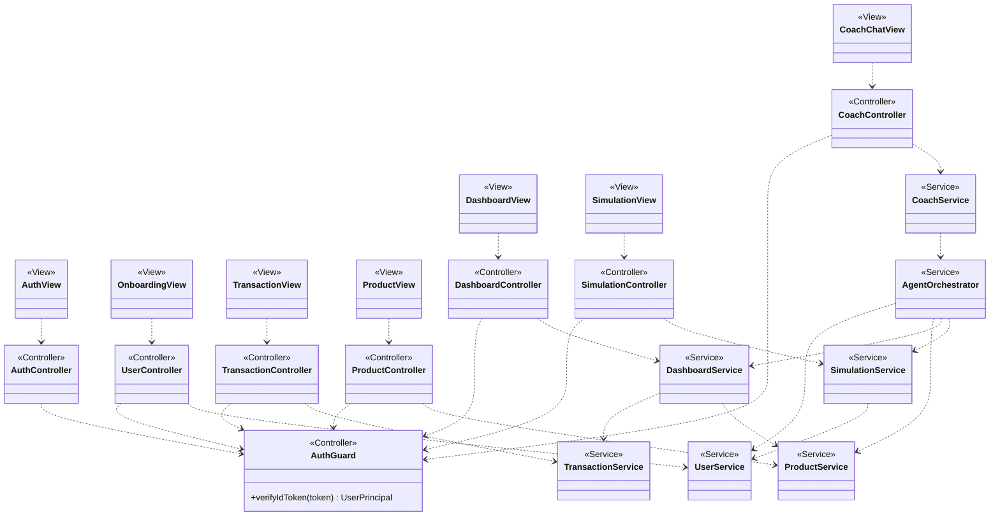
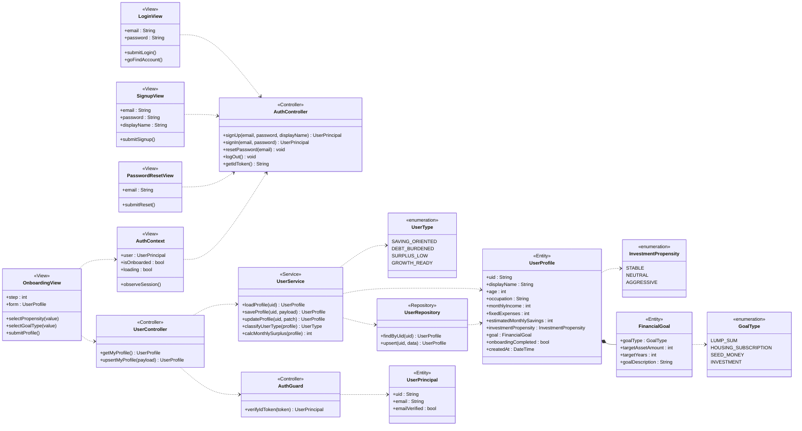
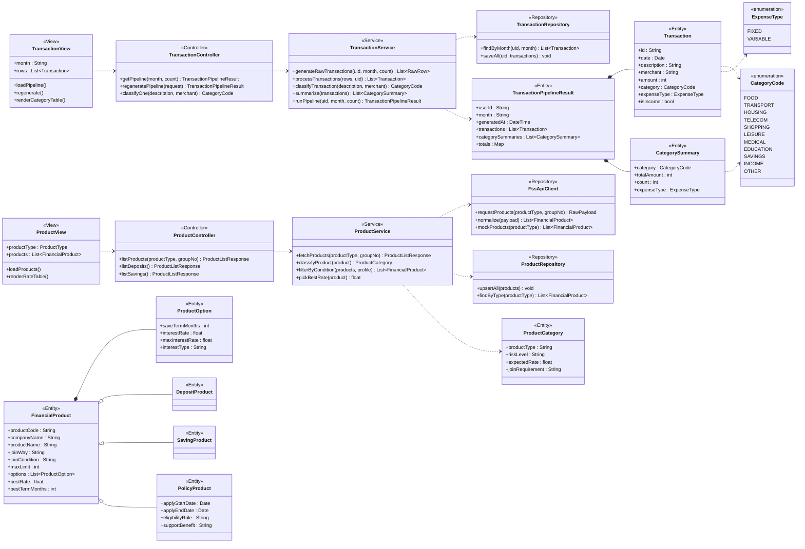
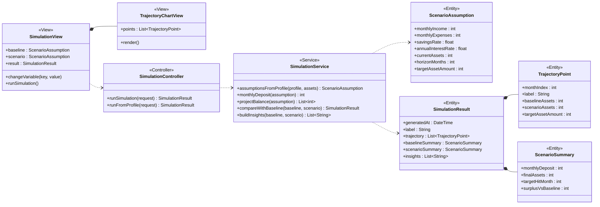
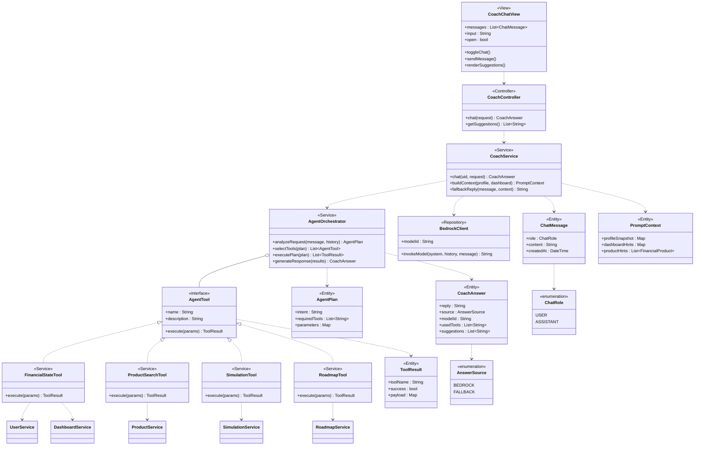

# 클래스 다이어그램

> **기준 문서:** [기능 명세서](./기능%20명세서.md) v1.0
> **적용 구조:** MVC (Model – View – Controller)

---

## 1. 설계 원칙

### MVC 매핑

| 계층 | 구현 위치 | 책임 |
|------|-----------|------|
| **View** | React 페이지 · 컴포넌트 (`frontend/src/pages`, `components`) | 화면 렌더링, 사용자 입력 수집, 시각화 |
| **Controller** | FastAPI 라우터 (`backend/app/routes`) + 프론트 API 클라이언트 (`frontend/src/services`) | 요청 수신 · 인증 · 검증, Model 호출, 응답 반환 |
| **Model** | 도메인 엔티티 (`backend/app/models`) + 서비스 · 리포지토리 (`backend/app/services`) | 상태 보관, 비즈니스 규칙, 외부 연동 |

### 의존 방향

```text
View ──▶ Controller ──▶ Model(Service) ──▶ Model(Entity / Repository)
                                              └──▶ 외부 시스템 (Firestore · FSS · Bedrock)
```

- 역방향 참조 금지. Model은 View · Controller를 알지 못함
- View는 Model 엔티티를 직접 조작하지 않고 Controller가 반환한 DTO만 사용
- 모든 Controller는 `AuthGuard`를 거쳐 사용자 식별자를 확보

### 표기

- 현재 백엔드 구현은 함수 기반이며, 본 다이어그램은 **책임 단위를 클래스로 표현**한 설계 뷰임
- `<<View>>` `<<Controller>>` `<<Service>>` `<<Entity>>` `<<Repository>>` 스테레오타입으로 계층 구분

---

## 2. 전체 구조



---

## 3. 온보딩 (기능 명세 1)

회원 관리 · 기본 정보 설정 · 기본 데이터 관리.



---

## 4. 데이터 관리 (기능 명세 2)

금융 거래 데이터 · 금융 상품 데이터.



---

## 5. 개인화 대시보드 (기능 명세 3)

자산 포트폴리오 · 소비 분석 · 목표 Gap · 금융전략 추천 · 금융 로드맵.

```mermaid
classDiagram
    direction TB

    class DashboardView {
        <<View>>
        +dashboard : DashboardResult
        +loadDashboard()
        +renderGoalProgress()
    }
    class PortfolioDonutView {
        <<View>>
        +slices : List~PortfolioSlice~
        +render()
    }
    class ConsumptionChartView {
        <<View>>
        +bars : List~ConsumptionBar~
        +render()
    }
    class RoadmapTimelineView {
        <<View>>
        +steps : List~RoadmapStep~
        +render()
    }

    class DashboardController {
        <<Controller>>
        +getDashboard() DashboardResult
        +computeDashboard(request) DashboardResult
    }

    class DashboardService {
        <<Service>>
        +buildDashboard(uid, request) DashboardResult
    }
    class PortfolioService {
        <<Service>>
        +loadComposition(uid, profile) AssetPortfolio
        +estimateCurrentAssets(profile) int
    }
    class ConsumptionService {
        <<Service>>
        +analyzeMonthly(pipeline) ConsumptionAnalysis
        +splitFixedVariable(pipeline) Map
    }
    class GoalGapService {
        <<Service>>
        +calcAchievementRate(assets, goal) float
        +calcGapAmount(assets, goal) int
        +estimateAchievementDate(assets, capacity, goal) Date
    }
    class StrategyService {
        <<Service>>
        +calcSavingCapacity(profile, consumption) SavingCapacity
        +recommendProducts(profile, products) List~RecommendedProduct~
        +prioritizeDebtRepayment(debt, capacity) List~DebtRepaymentPlan~
    }
    class RoadmapService {
        <<Service>>
        +buildSteps(profile, capacity, gap) List~RoadmapStep~
        +applyProductSchedule(steps, products) List~RoadmapStep~
        +projectAssetPath(profile, capacity) List~AssetPathPoint~
    }

    class DashboardResult {
        <<Entity>>
        +generatedAt : DateTime
        +month : String
        +portfolio : AssetPortfolio
        +consumption : ConsumptionAnalysis
        +goal : GoalProgress
        +roadmap : FinancialRoadmap
        +recommendedProducts : List~RecommendedProduct~
        +debtRepaymentPriority : List~DebtRepaymentPlan~
    }
    class AssetPortfolio {
        <<Entity>>
        +totalAssets : int
        +debtBalance : int
        +slices : List~PortfolioSlice~
    }
    class PortfolioSlice {
        <<Entity>>
        +key : String
        +label : String
        +amount : int
        +ratio : float
    }
    class ConsumptionAnalysis {
        <<Entity>>
        +month : String
        +bars : List~ConsumptionBar~
        +fixedTotal : int
        +variableTotal : int
        +incomeTotal : int
    }
    class ConsumptionBar {
        <<Entity>>
        +category : CategoryCode
        +amount : int
        +expenseType : ExpenseType
    }
    class GoalProgress {
        <<Entity>>
        +currentAssets : int
        +targetAssetAmount : int
        +gapAmount : int
        +achievementRate : float
        +estimatedMonthsToGoal : int
        +estimatedAchievementDate : Date
        +onTrack : bool
    }
    class SavingCapacity {
        <<Entity>>
        +monthlyIncome : int
        +fixedExpenses : int
        +variableExpenses : int
        +debtService : int
        +monthlyCapacity : int
    }
    class RecommendedProduct {
        <<Entity>>
        +product : FinancialProduct
        +matchScore : float
        +reason : String
    }
    class DebtRepaymentPlan {
        <<Entity>>
        +priority : int
        +targetDebt : String
        +interestRate : float
        +monthlyAmount : int
        +reason : String
    }
    class FinancialRoadmap {
        <<Entity>>
        +steps : List~RoadmapStep~
        +assetPath : List~AssetPathPoint~
    }
    class RoadmapStep {
        <<Entity>>
        +priority : int
        +title : String
        +detail : String
        +category : String
        +scheduledAt : Date
    }
    class AssetPathPoint {
        <<Entity>>
        +monthIndex : int
        +label : String
        +expectedAssets : int
        +achievementRate : float
    }

    DashboardView ..> DashboardController
    DashboardView *-- PortfolioDonutView
    DashboardView *-- ConsumptionChartView
    DashboardView *-- RoadmapTimelineView

    DashboardController ..> DashboardService
    DashboardService ..> PortfolioService
    DashboardService ..> ConsumptionService
    DashboardService ..> GoalGapService
    DashboardService ..> StrategyService
    DashboardService ..> RoadmapService
    DashboardService ..> DashboardResult

    DashboardResult *-- AssetPortfolio
    DashboardResult *-- ConsumptionAnalysis
    DashboardResult *-- GoalProgress
    DashboardResult *-- FinancialRoadmap
    DashboardResult *-- RecommendedProduct
    DashboardResult *-- DebtRepaymentPlan
    AssetPortfolio *-- PortfolioSlice
    ConsumptionAnalysis *-- ConsumptionBar
    FinancialRoadmap *-- RoadmapStep
    FinancialRoadmap *-- AssetPathPoint
    StrategyService ..> SavingCapacity
```



---

## 6. 디지털 트윈 (기능 명세 4)

시나리오 설정 · 분석 · 시각화.



---

## 7. AI 금융코치 (기능 명세 5)

개인화 금융상담 · 금융상품 상담 · AI 에이전트 · 챗봇 인터페이스.

AI 에이전트(5.3)는 **Orchestrator + Tool** 구조로 설계함.
Tool은 기존 Service를 감싸는 어댑터이며, Agent가 Service를 직접 호출하지 않도록 경계를 둠.



---

## 8. 기능 명세 ↔ 클래스 매핑

| 기능 번호 | 기능 명 | View | Controller | Model |
|---|---|---|---|---|
| 1.1.1~1.1.4 | 로그인 · 가입 · 계정/비밀번호 찾기 | `LoginView` `SignupView` `PasswordResetView` | `AuthController` | `UserPrincipal` |
| 1.2.1~1.2.6 | 인적사항 · 소득 · 고정비 · 성향 · 목표 입력 | `OnboardingView` | `UserController` | `UserProfile` `FinancialGoal` `InvestmentPropensity` `GoalType` |
| 1.3.1~1.3.3 | 사용자 데이터 저장 · 조회 · 수정 | — | `UserController` | `UserService` `UserRepository` |
| 1.3.4 | 사용자 유형 분류 | — | — | `UserService.classifyUserType()` `UserType` |
| 1.3.5 | 세션 관리 | `AuthContext` | `AuthGuard` | `UserPrincipal` |
| 2.1.1~2.1.3 | 거래 등록 · 조회 · 분류/가공 | `TransactionView` | `TransactionController` | `TransactionService` `Transaction` `CategorySummary` |
| 2.2.1~2.2.2 | 금융상품 수집 · 저장 · 조회 | `ProductView` | `ProductController` | `FssApiClient` `ProductRepository` `FinancialProduct` `PolicyProduct` |
| 2.2.3 | 금융상품 분류 | — | — | `ProductService.classifyProduct()` `ProductCategory` |
| 3.1.1~3.1.2 | 자산 구성 조회 · 시각화 | `PortfolioDonutView` | `DashboardController` | `PortfolioService` `AssetPortfolio` `PortfolioSlice` |
| 3.2.1~3.2.2 | 월별 소비 · 고정/변동 지출 분석 | `ConsumptionChartView` | `DashboardController` | `ConsumptionService` `ConsumptionAnalysis` |
| 3.3.1~3.3.2 | 목표 달성률 · 달성 예상 시점 | `DashboardView` | `DashboardController` | `GoalGapService` `GoalProgress` |
| 3.4.1 | 월 저축 여력 계산 | `DashboardView` | `DashboardController` | `StrategyService` `SavingCapacity` |
| 3.4.2 | 맞춤 금융상품 추천 | `DashboardView` | `DashboardController` | `StrategyService` `RecommendedProduct` |
| 3.4.3 | 부채 상환 우선순위 제안 | `DashboardView` | `DashboardController` | `StrategyService` `DebtRepaymentPlan` |
| 3.5.1~3.5.4 | 금융계획 · 일정 · 자산경로 · 로드맵 시각화 | `RoadmapTimelineView` | `DashboardController` | `RoadmapService` `FinancialRoadmap` `RoadmapStep` `AssetPathPoint` |
| 4.1.1 | 재무 변수 변경 | `SimulationView` | `SimulationController` | `ScenarioAssumption` |
| 4.2.1~4.2.2 | 시나리오 결과 계산 · 로드맵 비교 | `SimulationView` | `SimulationController` | `SimulationService` `SimulationResult` `ScenarioSummary` |
| 4.3.1 | 비교 결과 시각화 | `TrajectoryChartView` | — | `TrajectoryPoint` |
| 5.1.1~5.1.2 | 재무정보 기반 상담 · 로드맵 Q&A | `CoachChatView` | `CoachController` | `CoachService` `PromptContext` `BedrockClient` |
| 5.2.1~5.2.3 | 상품 정보 · 비교 · 유의사항 안내 | `CoachChatView` | `CoachController` | `ProductSearchTool` `FinancialProduct` |
| 5.3.1 | 사용자 요청 분석 | — | — | `AgentOrchestrator.analyzeRequest()` `AgentPlan` |
| 5.3.2 | 서비스 기능 연계 | — | — | `AgentTool` 구현체 (`FinancialStateTool` `ProductSearchTool` `SimulationTool` `RoadmapTool`) |
| 5.3.3 | 응답 생성 | — | — | `AgentOrchestrator.generateResponse()` `CoachAnswer` |
| 5.4.1~5.4.2 | 챗봇 호출 · 대화형 질의응답 | `CoachChatView` | `CoachController` | `ChatMessage` |

---

## 9. 공통 규약

- **인증**: 모든 백엔드 Controller는 `AuthGuard.verifyIdToken()`을 거쳐 `UserPrincipal.uid`를 확보한 뒤 Service를 호출
- **외부 연동 실패 처리**: `FssApiClient` · `BedrockClient`는 키 부재 · 오류 시 mock / fallback 경로를 반환하여 전체 플로우가 중단되지 않도록 함
- **Model 재사용**: `DashboardService`와 `AgentOrchestrator`는 동일한 Service 계층을 사용하며, Agent 전용 로직을 별도 구현하지 않음
- **View 무상태 원칙**: 계산은 모두 Model 계층에서 수행하고 View는 결과 DTO의 렌더링만 담당
